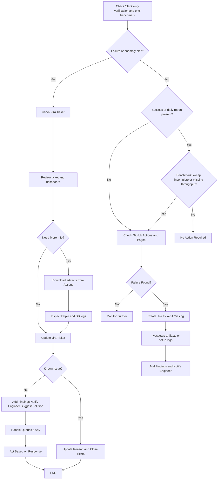

# Daily Test Monitoring & Failure Handling SOP

This document is a quick daily procedure for monitoring Kelpie tests and handling failures.

Jepsen (including ScalarDB Cluster) is documented in [scalar-jepsen](https://github.com/scalar-labs/scalar-jepsen/blob/master/docs/daily-test-checks.md). Test environment details for this repo are in [test-environment-and-setup.md](./test-environment-and-setup.md).

**This repo owns:** Kelpie ScalarDB verification (phantom-write, write-skew) and ScalarDB/ScalarDL benchmarks. **scalar-jepsen** owns Jepsen ScalarDB, ScalarDL, and Cluster dailies.

---

## 1. Daily Monitoring

* Check Slack:

  * `eng-verification` — ScalarDB Kelpie verification summary (webhook; channel is configured on the webhook secret).
  * `eng-benchmark` — ScalarDB and ScalarDL daily benchmark reports (throughput-vs-date image and dashboard link). Watch for a separate **anomaly** alert.

* If there is no failure message, or no success / report message:

  * Check GitHub Actions: https://github.com/scalar-labs/kelpie-test/actions
  * Check GitHub Pages: https://scalar-labs.github.io/kelpie-test/

* Confirm the expected scheduled runs completed (UTC):

  | Workflow | Cron | Approx IST |
  |----------|------|------------|
  | Daily DB verification | `0 10 * * *` | 15:30 |
  | Daily DB benchmark | `0 15 * * *` | 20:30 |
  | Daily DL benchmark | `0 18 * * *` | 23:30 |

Environments are ephemeral GitHub-hosted runners (Docker Compose / a Postgres container). There is no Azure VM to retain or destroy.

**Manual runs:** Slack, Jira, and GitHub Pages updates run only on `schedule`. `workflow_dispatch` skips them — check the Actions run and artifacts yourself.

---

## 2. Failure Handling (Slack Alert Present)

### Verification (`eng-verification`)

* Open the Jira ticket (project `DLT`). It includes the workflow run URL and the log artifact name (`verification-logs-<test>`).

* If more information is needed:

  * Download `verification-logs-<test>` (`kelpie.log` plus Cassandra logs for cassandra1–3) and `result-<test>`.
  * Reproduce locally if needed — see [test-environment-and-setup.md](./test-environment-and-setup.md).

* Update the ticket:

  * **Known issue** — record the reason and close the ticket. Compose already tore the cluster down (`docker compose down -v`).
  * **New issue** — add findings, notify the relevant engineer(s), include a potential solution if available, and wait for confirmation.

### Benchmark (`eng-benchmark`)

* A daily **report** in Slack is expected even on a healthy run. That is not a failure by itself.

* An **anomaly** alert (and a Jira ticket) means throughput at concurrency **16** fell outside the 14-day 3σ band. Open the ticket, the Pages dashboard, and the `benchmark-results` / `dl-benchmark-results` artifact (`summary.csv`, per-concurrency logs, plots).

* A Kelpie process failure during the concurrency sweep is logged in the sweep step but **does not fail the job** and **does not create a Jira ticket**. If Slack looks quiet but throughput is missing or the step summary shows failed concurrencies, treat that as a failure: inspect artifacts and create a Jira ticket if none exists.

---

## 3. Failure Handling (No Slack Alert / No Ticket)

If a failure occurred and Slack/Jira are missing:

* Check the Actions run (build, compose up, schema-loader, ledger startup).
* Create a Jira ticket in `DLT` with the run URL and findings.
* Download artifacts if they exist.
* Notify the relevant engineer(s) and wait for a response.

This path is the normal one for `workflow_dispatch` and for benchmark Kelpie exit failures (see above).

---

## 4. Workflow Diagram

---

## 5. Additional details

* How environments are created and how to reproduce a failed run: [test-environment-and-setup.md](./test-environment-and-setup.md)
* Jepsen daily tests (ScalarDB, ScalarDL, Cluster): [scalar-jepsen daily SOP](https://github.com/scalar-labs/scalar-jepsen/blob/master/docs/daily-test-checks.md)
